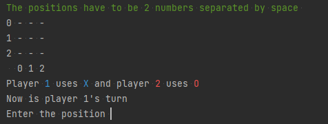
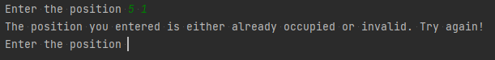
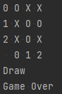
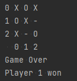

# tic tac toe
 A tic tac toe game i made using a matrix
 ## How to play the game

When the game starts you can choose the position you want by typing the number of the <b>row</b> and then the <b>column</b>

## Different messages you can get
- `Entering an invalid position`

   

- `Game draw`

   

- `Game Over`

   

